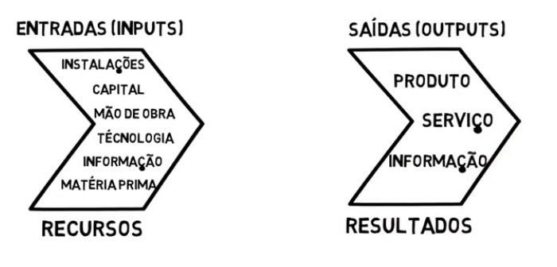
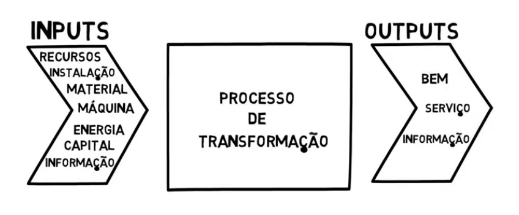

# IF100 - Gestão de Produção

A disciplina vai ficar no básico de gestão de produção 

"
Introdução a gestão de produção
conceitos fundamentais de gestão de produção
estratégia operacional e competividade
concepção para a produção 
planejamento de operações
melhoria de produtos e serviços"

"
introdução a gestão de produção
modelo de transformação
estratégia de produção
planejamento de capacidade
localização de instalações
Projeto de produto e do processo
Arranjo físico
1EE
Previsão de demanda
Planejamento agregado
Programação e Controle de Produção
Sistema de Produção Enxuta
Melhorias na gestão da produção
Gestão de Qualidade e Gestão Ambiental
2EE
"
Nota: Provas + Atividades
(ASP - Atividade que conta como carga horária)

Gestão é um pouco mais que administrar é gerenciar todas as nuancias de uma empresa.

Diferença: Produção x Serviço

https://www.youtube.com/watch?v=mrSqnzmo-a4

Conceitos: 

Produção - Produção é a transformação de entradas (inputs) em saídas (outputs). 

Entrada (input) - São os recursos necessários para a realização da produção (instalações, capital, mão de obra, técnologia, informação, matéria prima)

Saídas (output) - São os resoltados da transformação realizados no processo produtivo (produto, serviço e informações)

Produção também pode ser definida como atividade de combinação dos fatores, que tem como finalizade de satisfazer as necessidades do ser humano

A produção é um processo de criação de valor

Sistema x Valor

Sistema é um conjunto de elementos que se relacionam 

Valor é uma qualidade que se confere as coisas

Produção também é definida como atividade da combinação dos fatores. Os sistema que tem a finalidade de satisfazer a necessidades do ser humano

A Produção é um processo de crianção de valor

Gestão da Produção - visa flexibilizar os sistemas de produção com rapidez no projeto e implementação de novos produtos e processos. Com mais baixos tempos de produção (lead time) e estoques direcionados ao atendimento das necessidades do cliente (satisfação do cliente) tendo como objetivo redução dos custos da produção refletidos em maiores márgens de lucro e preços competitivos, garantido assim a satisfação do cliente. Também com o principal foco na qualidade atendeno assim os requisitos definidos e exigidos pelo cliênte. Também tem o objetivo de confiabilidade e velocidade nos prasos de entrega melhorando assim o seu desempenho de entrega e flexibilidade ser capáz de reagir de forma rápida a situações repentínas e inesperadas.

----

no final do curso saber: o que é uma produção, diferença de produção de bens, o que é um serviço, o que faz funcionar, porque escolher a localização é importante, o que é demanda, o que é qualidade, o que é sistema de gestão ambiental...
